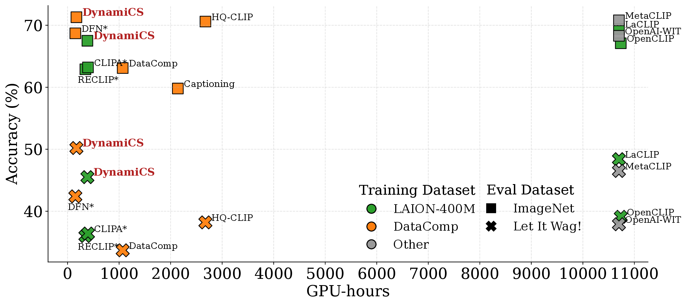

# DynamiCS

DynamiCS is an efficient and long-tail-aware data sampling method for vision-language model (VLM) pre-training. This repository contains the code used to build dynamic cluster-based sampling probabilities and to plug them into an OpenCLIP-style training pipeline.

[](https://arxiv.org/abs/2604.27932)
[](https://huggingface.co/MingliangLiang3/DynamiCS-ViT-B-16-DataComp-DFN)

## Main Results

Zero-shot top-1 classification on ImageNet-1K and *Let It Wag!* with full-training CLIP baselines. All models use a ViT-B/16 image encoder.




| Models | Dataset (Data Size) | Samples Seen @ Resolution | Tokens | ImageNet-1K | *Let It Wag!* | GPU-hours |
| --- | --- | --- | ---: | ---: | ---: | ---: |
| OpenAI-WIT | `--- (400M)` | `12.8B@224` | 274 | 68.3 | 37.9 | 10700 |
| MetaCLIP-400M | `--- (400M)` | `12.8B@224` | 274 | 70.8 | 46.5 | `~10700` |
| OpenCLIP | `LAION-400M (400M)` | `12.8B@224` | 274 | 67.1 | 39.1 | 10736 |
| LaCLIP | `LAION-400M (400M)` | `12.8B@224` | 274 | 69.4 | 48.4 | `~10700` |
| DynamiCS (Ours) | `LAION-400M (298M)` | `2.56B@112 + 128M@224` | 81 | 67.5 | 45.5 | 299 |
| OpenVision | `Recap-DataComp-1B (1.4B)` | `12.8B@160 + 1.024B@224 + 256M@336` | 180 | 73.9 | `---` | `---` |
| DynamiCS (Ours) [[ckpt]](https://huggingface.co/MingliangLiang3/DynamiCS-ViT-B-16-DataComp-DFN) | `DataComp-DFN (130M)` | `1.28B@112 + 128M@224` | 81 | 71.3 | 50.2 | 163 |
| DynamiCS (Ours) [[ckpt]](https://huggingface.co/MingliangLiang3/DynamiCS-ViT-B-16-DataComp-DFN) | `DataComp-DFN (130M)` | `2.56B@112 + 128M@224` | 81 | 72.6 | 52.0 | 299 |

Key takeaways from the paper:

- On `LAION-400M`, DynamiCS reaches `67.5` on ImageNet-1K and `45.5` on *Let It Wag!* using `299` GPU-hours, compared with `10736` GPU-hours for full-training OpenCLIP.
- On `DataComp-DFN`, DynamiCS reaches `72.6` on ImageNet-1K and `52.0` on *Let It Wag!* with only `81` tokens and `299` GPU-hours.
- DynamiCS is especially strong on long-tail recognition, outperforming OpenCLIP, MetaCLIP-400M, and OpenAI-WIT on *Let It Wag!* while using substantially less compute.

The DataComp-DFN checkpoints and released SHA256-keyed sampling file are hosted on Hugging Face:
[`MingliangLiang3/DynamiCS-ViT-B-16-DataComp-DFN`](https://huggingface.co/MingliangLiang3/DynamiCS-ViT-B-16-DataComp-DFN)

## Installation

This repository follows the standard [OpenCLIP](https://github.com/mlfoundations/open_clip) installation flow.

### Virtualenv

```bash
python3 -m venv .venv
source .venv/bin/activate
make install
make install-training
```

### Other Dependencies

For the DynamiCS preprocessing pipeline and sampling-aware training, you will also need:

- `orjson` for loading sampling-probability JSON files in `src/open_clip_train/data.py`
- `pyarrow` for parquet metadata written by `tests/DynamiCS/embedding_dinov2.py`
- a FAISS build such as `faiss-cpu` or `faiss-gpu` for clustering and nearest-neighbor search

For the exact environment used in our experiments, see [`myenv.yml`](myenv.yml).

## Data

### Data Download

We use **LAION-400M** and a **DataComp** subset filtered by DFN. Choose one of the following options:

**Option A — Download LAION-400M and DataComp directly:**
- Follow the instructions at [DataComp](https://github.com/mlfoundations/datacomp#downloading-commonpool).
- Follow the instructions at [img2dataset](https://github.com/rom1504/img2dataset) to download LAION-400M.

**Option B — Build the DFN-filtered subset from scratch:**
1. Download the DFN filter index from [apf1/datafilteringnetworks_2b](https://huggingface.co/datasets/apf1/datafilteringnetworks_2b).
2. Match the index with DataComp using [adams-story/dfn-200m](https://huggingface.co/datasets/adams-story/dfn-200m).
3. Download the matched subset using [img2dataset](https://github.com/rom1504/img2dataset).

## DynamiCS Pipeline

The full DynamiCS workflow, including DINOv2 embedding extraction, FAISS clustering, sampling-probability generation, OpenCLIP training examples, and Slurm script references, is documented on a separate page:

[`tests/DynamiCS/README.md`](tests/DynamiCS/README.md)

That guide also explains the difference between the filename-keyed sampling JSON used during training and the SHA256-keyed companion file released for open-source distribution.

## Evaluation

We use [CLIP Benchmark](https://github.com/LAION-AI/CLIP_benchmark) to evaluate on a standard suite of 38 datasets in zero-shot classification and retrieval settings.

## Acknowledgements

DynamiCS is implemented on top of [OpenCLIP](https://github.com/mlfoundations/open_clip). Please also cite and acknowledge the OpenCLIP project if you use this repository in your work.

This work used the Dutch national e-infrastructure with the support of the SURF Cooperative using grant no. `EINF-17261`. The computations were carried out on the Snellius supercomputer.

## License

This repository is released under the [MIT License](LICENSE).


## Citation

If you use DynamiCS in your research, please cite the paper:

```bibtex
@article{liang2026dynamics,
  title={Dynamic Cluster Data Sampling for Efficient and Long-Tail-Aware Vision-Language Pre-training},
  author={Liang, Mingliang and Liu, Zhuoran and de Vries, Arjen P. and Larson, Martha},
  journal={arXiv preprint arXiv:2604.27932},
  year={2026}
}
```

The repository metadata is also available in [`CITATION.cff`](CITATION.cff).


## Contact

For questions about DynamiCS, checkpoint access, or potential collaboration, please:

- open an issue at [MingliangLiang3/DynamiCS](https://github.com/MingliangLiang3/DynamiCS/issues)
- contact Mingliang Liang at `mliang@cs.ru.nl`
